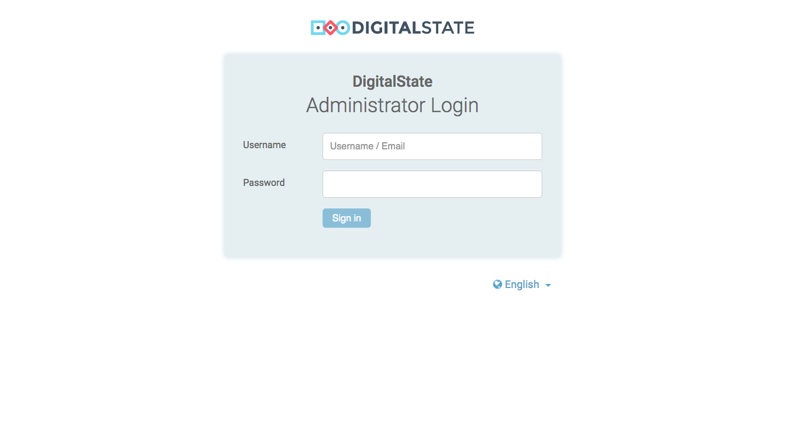
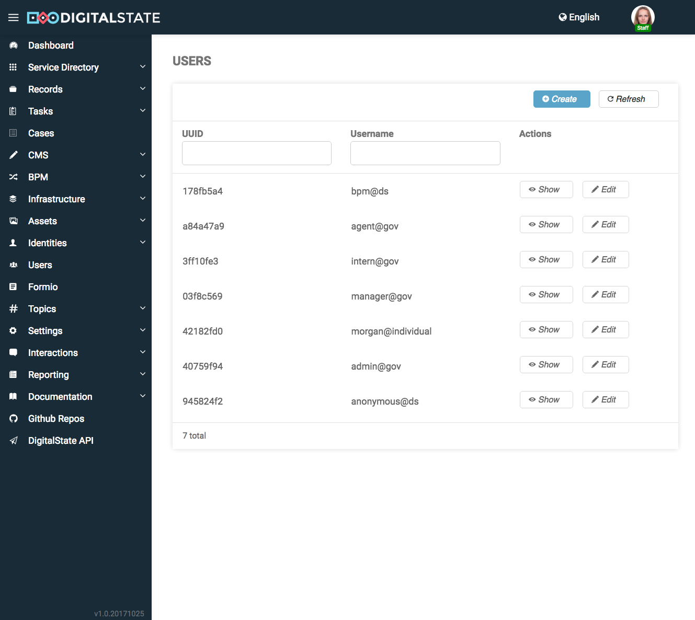
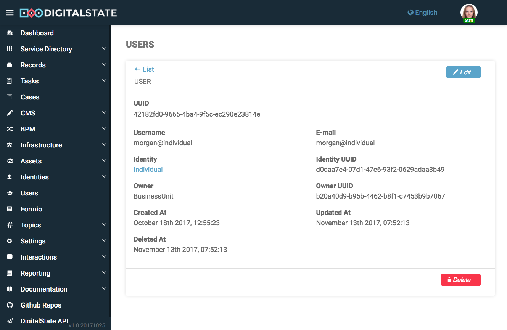
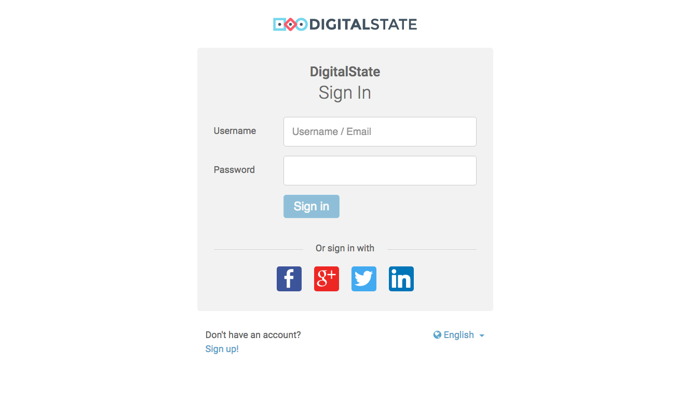
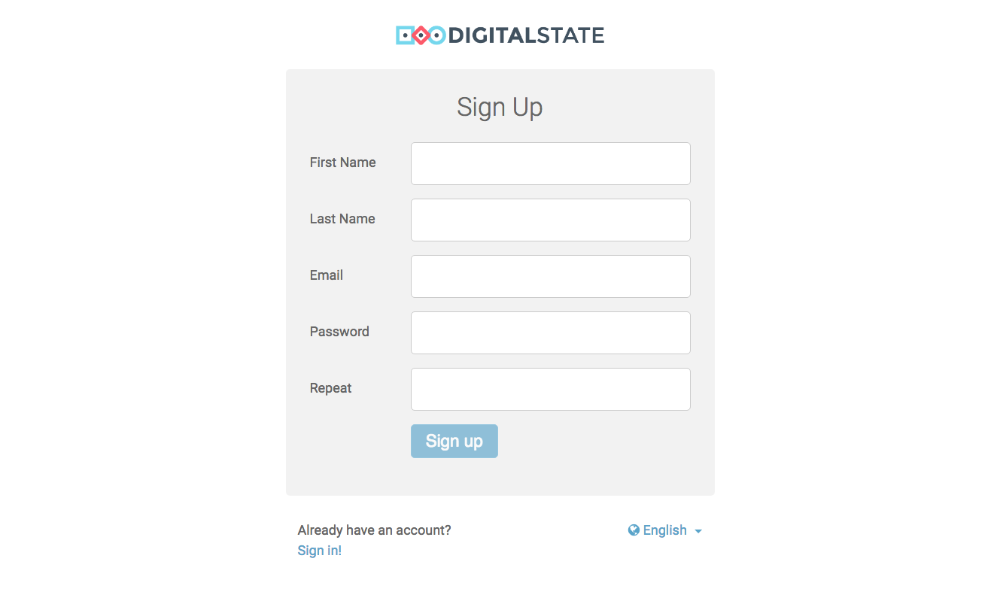

# Authentication

The Authentication microservice provide centralized login cpabilities for "users" which have a assoication with a Identity.

Authentication preforms the following functions:

1. Login / Logout
1. JWT Issueing / Management
1. User Management
1. Password Recovery

The Authentication microservice managers "users" which are the accounts that are used to login as a Individual, Organization, and Staffer.  

No personal data about an identity is or should be stored in the Authentication microservice.

## Screenshots

The following are screenshots from the Portal and Admin UI

### Admin



---



---



---

### Portal (Individuals)



---



[](https://travis-ci.org/DigitalState/Authentication)

## Table of Contents

- [Synopsis](#synopsis)
- [Installation](#installation)
- [Documentation](#documentation)
- [Contributing](#contributing)
- [History](#history)
- [Credits](#credits)

## Synopsis

Synopsis...

## Installation

Run docker.

```
docker-compose up -d
```

Run database migrations.

```
docker-compose exec php php bin/console doctrine:migrations:migrate
```

Run dev data fixtures (optional).

```
docker-compose exec php php bin/console doctrine:fixtures:load
```

## Documentation

1. [LDAP/Active Directory Integration](./docs/ldap.md)
1. [Social Media Login Integration](./docs/social_media.md)
1. Swap Authentication microservice with a third-party authentication system (Cloud, Gluu, Keycloak, etc)
1. JWT Sctructure and Details

Further documentation can be found in the [Documentation Repository](https://github.com/DigitalState/Documentation)

## Contributing

Please read [CONTRIBUTING.md](CONTRIBUTING.md) for details on our code of conduct, and the process for submitting pull requests to us.

## History

History..

## Credits

Credits...